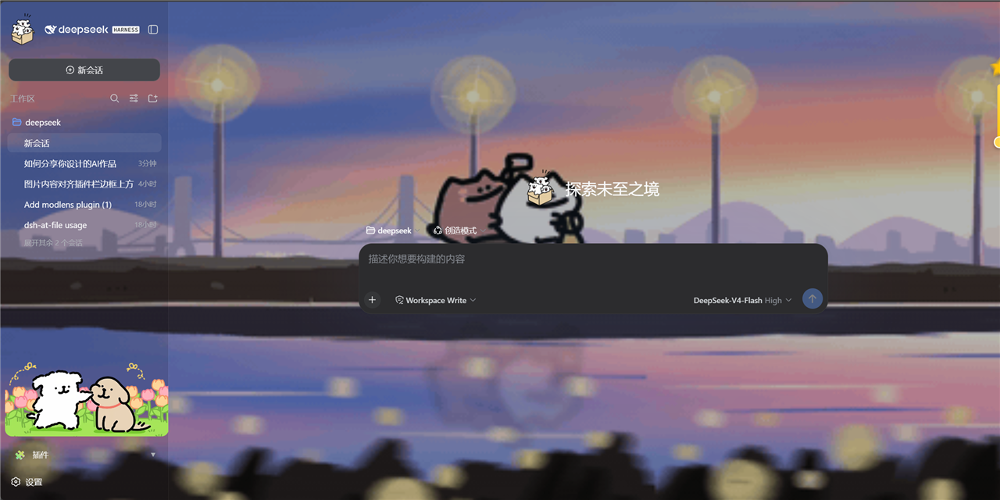

# DeepSeek Harness 本地配置与插件集



一套为 **DeepSeek Harness（DSH）Web 界面**打造的本地插件与壁纸资源合集，全部开源。

> 作者：线条小狗 (Line Dog) · GitHub：[2154911078-ship-it](https://github.com/2154911078-ship-it)

包含两个功能插件（GIF 动态壁纸、`@文件` 选择附加）和一套动态壁纸资源库，以及配套的安装 / 同步脚本。所有代码均为纯 JavaScript + PowerShell，无编译步骤，复制即用。

## 目录结构

```
deepseek/
├── docs/preview.png           # 仓库预览图（README 顶部展示）
├── dsh-gif-wallpaper/         # 插件：GIF 动态壁纸（网页背景）
│   ├── package.json           #   插件元数据（Cordis 客户端注入声明）
│   ├── client.js              #   浏览器端：透明度滑块 / 暂停播放 / 面板汉化
│   ├── lib/index.js           #   Host 端：/dsh-wallpaper 等 HTTP 路由
│   └── lib/index.d.ts         #   类型声明
├── dsh-at-file/               # 插件：输入框输入 @ 弹出工作区文件选择器
│   ├── package.json
│   ├── client.js              #   浏览器端：@ 触发文件选择浮层
│   ├── lib/index.js           #   Host 端：文件列表接口 + 消息内联扩展
│   ├── lib/index.d.ts
│   └── smoke.mjs              #   Host 端冒烟测试（mock ctx 驱动 apply()）
├── wallpapers/                # 壁纸库
│   ├── steam-wallpaper.gif    #   动态壁纸资源
│   ├── sync-wallpapers.ps1    #   同步脚本：把图片安装到 GUI 壁纸库
│   └── 说明.txt                #   使用说明
├── wallpaper.gif              # 默认壁纸（插件自带）
├── 89898.png                  # 设计图
├── check-dshmarket.mjs        # 开发辅助：查询 dshmarket registry 信息
└── dsh-boot-fix.ps1           # 机器相关：开机卡 logo 修复脚本（可选，慎用）
```

## 插件一：dsh-gif-wallpaper（GIF 动态壁纸）

把一张 GIF 变成 DSH 网页界面的动态背景。

**功能**
- Host 端通过内置 webServer 提供同源路由：
  - `GET /dsh-wallpaper` —— 返回当前 GIF 文件（`image/gif`）
  - `GET /dsh-wallpaper-static` —— 返回 GIF 首帧提取的 JPEG
  - `GET /dsh-wallpaper/status` —— 返回 `{ ok, version, size, name }`，供前端检测变更
- 浏览器端右上角「空心星 + 竖条滑块」控制壁纸透明度（0–100%），星标随数值升高变黄
- 侧栏底部暂停 / 播放按钮
- 附带 Cordis 徽标汉化、Cordis 面板宽度对齐、插件栏上方横幅图对齐
- 前端每 15 秒轮询 `/dsh-wallpaper/status`，替换 GIF 文件即可**热切换壁纸**，无需重启

**壁纸路径（按优先级查找）**

1. 环境变量 `DSH_WALLPAPER_PATH`（显式指定 GIF 文件路径）
2. 进程工作目录下的 `wallpaper.gif`
3. 内置候选路径（默认值见 `dsh-gif-wallpaper/lib/index.js` 的 `CANDIDATES`）

## 插件二：dsh-at-file（@文件 选择附加）

在输入框输入 `@`（单词边界处）弹出工作区文件选择器，选中后文件内容随消息发送给 Agent。

**功能**
- `GET /dsh-at-file/list?cwd=<工作区>&q=<查询>` —— 返回有界的工作区文件目录，按匹配度排序（仅文件、正斜杠相对路径、最多 2000 个文件、深度 4、结果 60 条）
- `agent/pre-step` 消息扩展：扫描用户消息中的 `@token`，在工作区内解析并**把文件文本内联进进入模型的那一步**；原始会话记录保留 `@token` 不变
- 解析失败的 token（错字、`@user`、邮箱、目录、二进制、超大文件）原样保留，不破坏普通文本
- 保留瀑布流调用链：`next()` 先执行，仅在确实扩展时才替换决策

**路径安全**：只解析工作区根目录**内部**的文件，`node_modules`、`.git`、`dist` 等目录一律跳过。

## 安装到 DSH

插件是「复制 + 声明」两步安装，无需编译：

1. 把 `dsh-gif-wallpaper`、`dsh-at-file` 两个文件夹复制到你的 DSH profile 的
   `node_modules` 目录下（例如 `%USERPROFILE%\.dsh\profiles\node_modules\`）。
2. 在 profile 的补丁层 `cordis.patch.yml`（例如 `%USERPROFILE%\.dsh\profiles\web\cordis.patch.yml`）中加入插入条目：

```yaml
- insert:
    - id: "dsh-gif-wallpaper"
      name: "dsh-gif-wallpaper"
- insert:
    - id: "dsh-at-file"
      name: "dsh-at-file"
```

3. 重启 DSH Web 服务即可生效。

## 壁纸库用法

1. 把想用的壁纸图片（gif / png / jpg / jpeg / webp / bmp）放进 `wallpapers/` 文件夹。
2. 运行 `wallpapers/sync-wallpapers.ps1`（右键 → 使用 PowerShell 运行）。脚本会把图片
   安装到 GUI 的壁纸库并生成 `manifest.json`；默认目标目录可通过参数 `-DistPaths` 覆盖。
3. 打开网页，点击左下角侧栏「插件」→ 壁纸列表点 🔄 刷新，再点击任意壁纸即可切换。

- 当前选择的壁纸自动保存，刷新 / 重启后仍生效。
- 「默认壁纸」= 插件自带的 `wallpaper.gif`。
- 透明度：右上角星星 + 竖条滑块控制壁纸显示强度（向上减少、向下增加）。

## 许可

MIT License。详见 [LICENSE](LICENSE)。

## 免责声明

- `dsh-boot-fix.ps1` 是**机器相关**的开机修复脚本（禁用服务、关闭快速启动、清理目录），
  请仅在确认需要时使用，发布到公共仓库前建议自行评估是否包含。
- 各插件内默认的壁纸路径与 Wallpaper Engine 工坊资源路径为原作者机器的实际路径，
  在其它机器上请通过环境变量或修改 `CANDIDATES` 适配。
